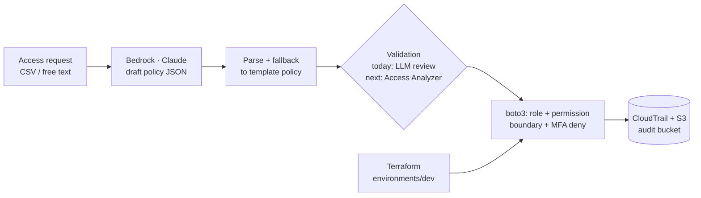

# AI-Assisted IAM Provisioning on AWS (Prototype)

A prototype that turns an access request written in plain English ("data analyst who needs read access to the analytics lake") into a draft IAM policy with **Amazon Bedrock (Claude)**. It then provisions roles, permission boundaries and MFA enforcement with Python/boto3 and Terraform.

> **Prototype, not a product.** I built and ran this in my own AWS dev account. "CloudMart" is a fictional e-commerce company used as the scenario, and the users in `enterprise_users.csv` are made up. The interesting part is the design question it raises: **how do you let an LLM draft access policies without letting it grant access?** Section 4 is my answer.

---

## 1. Problem

Access requests arrive as free text ("needs S3 and Glue for the churn project"). An engineer then hand-writes a policy, usually too broad, because least privilege is slow to get right. LLMs are good at the translation step, but an LLM that can write IAM policies is a privilege-escalation path unless its output is treated as **untrusted input**.

## 2. Architecture



| Component | File |
|---|---|
| Policy drafting (Claude via Bedrock, JSON extraction, fallback template) | `ai-integration/policy-generator/bedrock_policy_generator_v45.py`, `src/ai/bedrock_policy_generator.py` |
| Provisioning: permission boundaries, roles, MFA-deny policy, audit logging | `src/core/deploy_enterprise_iam.py`, `src/core/enterprise_iam_manager.py` |
| Terraform (roles for dev) | `terraform/environments/dev`, `terraform/modules/iam-roles` |
| Clean-up of everything created | `scripts/maintenance/cleanup_aws_resources.py` |

## 3. Key decisions and trade-offs

- **Low temperature, JSON-only prompt, deterministic fallback.** The model is asked for policy JSON only (temperature 0.1). If parsing fails, the code falls back to a known template for the role type rather than guessing.
- **Permission boundaries on every role.** Even if a drafted policy is too broad, the boundary caps what the role can ever do. This matters most when policies are machine-generated.
- **MFA-deny by default.** An inline policy denies everything except MFA self-management until the principal has authenticated with MFA.
- **Boto3 for the workflow, Terraform for the baseline.** Per-request provisioning is imperative (boto3). Standing roles live in Terraform. In a real rollout I'd move per-request resources into Terraform too, so there's one source of truth (see below).

## 4. Known limitations / what I'd do next

This is the honest list, and it's also the roadmap:

1. **Validation is an LLM grading an LLM.** `analyze_policy_security()` asks the model to review its own draft, which is not a control. **Next:** gate every draft with deterministic checks:
   - IAM Access Analyzer `ValidatePolicy` (errors and security warnings)
   - `CheckNoNewAccess` against the role's approved baseline
   - `CheckAccessNotGranted` for a deny-list (`iam:*`, `sts:AssumeRole` on `*`, `kms:Decrypt` on `*`)

   A human then approves the diff in a pull request before Terraform applies it.
2. **Prompt injection.** The free-text "business justification" goes straight into the prompt, so a request can ask for more access. The deterministic gate above is the real defence; the prompt is not.
3. **The compliance checks are placeholders.** The "SOC 2 / ISO 27001" functions return fixed values. This repo makes **no** compliance claims.
4. **Long-lived IAM users.** The prototype creates IAM users with console passwords. Today I'd use IAM Identity Center permission sets (or roles + SSO) and no long-lived credentials.
5. **The role trust policies are too clever.** `aws:SourceIp` conditions with private ranges mean the roles can't be assumed over the public STS endpoint. They should be dropped in favour of SSO + MFA conditions.
6. **Terraform is partial.** Only the `iam-roles` module is wired into `environments/dev`. The `enterprise-iam` and `iam-automation` modules are drafts and not deployed.
7. **Multi-cloud sync (`cloud_iam_sync.py`) and anomaly detection are stubs.**

## 5. Evidence

- In my dev account I ran policy generation against Bedrock (Claude 3 Sonnet, then Sonnet 4.5), and created 4 test users, 3 roles with permission boundaries, an MFA-deny policy, and a CloudTrail trail with an audit bucket. `scripts/maintenance/cleanup_aws_resources.py` removes all of it.
- A 100-user bulk-create test against IAM completed in ~27 s. Larger-scale numbers in earlier versions of this README were projections, and I've removed them.

## 6. Run it yourself

Prerequisites: Python 3.10+, AWS credentials for a **sandbox** account, and Bedrock model access enabled for Anthropic Claude in `us-east-1`.

```bash
pip install -r requirements.txt

# Draft a policy (no IAM changes)
python ai-integration/policy-generator/bedrock_policy_generator_v45.py

# Terraform baseline roles
cd terraform/environments/dev && terraform init && terraform plan

# Clean up anything the scripts created
python scripts/maintenance/cleanup_aws_resources.py
```

**Cost:** pennies. The costs are a few Bedrock calls (well under $1 for experimentation) and a small CloudTrail/S3 footprint. IAM itself is free.

---

**Abdihakim Said**, AWS Solutions Architect · CKA. I help teams adopt AI in cloud operations *safely*: LLMs draft, deterministic controls decide. Contact details are on my [GitHub profile](https://github.com/abdihakim-said).
